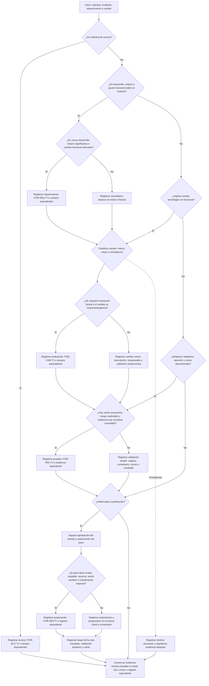

# Diagrama de Uso de Formatos TIC

Este material es una guía de apoyo para decidir cuándo conviene utilizar los formatos TIC. No reemplaza directivas, procedimientos ni estándares, y no crea obligaciones adicionales cuando Jira, Mesa de Servicios, correo, comentario estructurado o registro equivalente contiene información suficiente.

## Uso Práctico de los Formatos

La firma o aprobación no siempre exige imprimir, firmar y escanear un formato. Puede realizarse mediante firma física, firma digital, correo institucional, comentario en Jira, ticket de Mesa de Servicios, aprobación digital o registro equivalente, siempre que permita identificar quién aprobó, qué aprobó y cuándo.

Cuando el formato se use como documento separado, deberá completarse, remitirse al responsable que corresponda, recibir la conformidad o aprobación, y luego adjuntarse o referenciarse en el ticket, historia, correo o registro principal.

Cuando el formato se reemplace por comentario o registro en ticket, no se elimina el control. El ticket debe contener información suficiente y trazable para reconstruir la solicitud, aprobación, validación o autorización correspondiente.

En todos los casos debe existir una evidencia mínima. Lo que puede omitirse es el archivo del formato cuando existe un registro equivalente; no debe omitirse la anotación, comentario, correo, captura, log, aprobación o referencia que permita reconstruir qué se pidió, qué se evaluó, qué se validó y quién autorizó cuando corresponda.

### FOR-REQ-TI - Requerimiento

#### Cuándo usarlo

Cuando se solicita un desarrollo nuevo, una mejora significativa o un cambio funcional relevante. Sirve para dejar claro la necesidad, el alcance, los criterios de aceptación y la conformidad esperada, especialmente cuando el requerimiento puede generar interpretaciones distintas entre el usuario y TI.

#### Requiere firma o aprobación

Sí, cuando se usa como documento separado o cuando el requerimiento tiene impacto funcional relevante. La conformidad debe darla el área usuaria, responsable funcional o usuario autorizado que valida la necesidad y el alcance.

#### Cómo se aprueba

Se completa el formato con la necesidad, alcance, criterios de aceptación y datos mínimos del requerimiento. Luego se remite al responsable funcional o usuario autorizado para revisión. La aprobación puede quedar mediante firma, correo, comentario en Jira/ticket, aprobación digital o medio institucional equivalente. Después, el formato aprobado o la evidencia de aprobación se adjunta o referencia en el ticket.

#### ¿Cuándo puede reemplazarse por comentario o registro en ticket?

Solo en desarrollos simples o ajustes funcionales de bajo impacto, siempre que el ticket, Jira, historia de usuario, correo o comentario estructurado contenga necesidad, alcance, criterios de aceptación y conformidad cuando corresponda.

Ejemplos: ajuste de texto, mejora visual, campo informativo, filtro simple o validación menor que no afecte montos, pagos, liquidaciones, seguridad, integraciones, reportes oficiales ni procesos críticos.

### FOR-CAM-TI - Cambio

#### Cuándo usarlo

Cuando el cambio es mayor, de emergencia o requiere evaluación formal por riesgo, impacto, seguridad, datos, continuidad operativa o afectación a procesos críticos. Sirve para registrar qué se va a cambiar, por qué, qué riesgo tiene y qué controles se aplicarán.

#### Requiere firma o aprobación

Sí. La aprobación debe darse antes de ejecutar el cambio, salvo emergencia debidamente justificada. Debe aprobarlo la Coordinación TIC o responsable designado de TIC y, cuando corresponda, el responsable técnico, área usuaria o responsable funcional.

#### Cómo se aprueba

Se completa el formato con descripción, justificación, tipo de cambio, riesgo, impacto, responsable y medidas de control. Luego se remite para aprobación por firma, correo, comentario en ticket/Jira, aprobación digital o medio equivalente. La evidencia aprobada queda adjunta o referenciada en el ticket.

#### ¿Cuándo puede reemplazarse por comentario o registro en ticket?

Solo en cambios menores, de bajo riesgo y bajo impacto, cuando el registro contenga descripción, justificación breve, responsable, tipo de cambio, riesgo y validación proporcional.

Ejemplos: ajuste visual, corrección de etiqueta, cambio menor de configuración o ajuste que no toque base de datos, seguridad, pagos, montos, liquidaciones, integraciones ni disponibilidad del servicio.

### FOR-PRU-TI - Pruebas o Validación

#### Cuándo usarlo

Cuando hay varios escenarios de prueba, riesgo medio o alto, impacto funcional o evidencia que conviene ordenar en un solo lugar. Sirve para demostrar qué se probó, quién lo probó, cuándo se probó y cuál fue el resultado.

#### Requiere firma o aprobación

Sí, cuando se usa como evidencia formal de validación. La conformidad se obtiene después de ejecutar las pruebas y antes del pase a producción, cuando el cambio requiere validación previa.

#### Cómo se aprueba

Se registran los casos probados, evidencias, resultados y responsable de validación. Luego el usuario funcional, responsable técnico o quien corresponda confirma la conformidad mediante firma, correo, comentario en Jira/ticket, aprobación digital o medio equivalente. Esa evidencia se adjunta o referencia en el ticket.

#### ¿Cuándo puede reemplazarse por comentario o registro en ticket?

Solo en cambios de bajo impacto con validación simple, siempre que la evidencia permita identificar qué se probó, quién lo probó, cuándo y cuál fue el resultado.

Ejemplos: captura de pantalla de una corrección visual, log de ejecución de una validación técnica simple, comentario del usuario confirmando un ajuste menor o resultado de prueba de un cambio que no afecte montos, pagos, liquidaciones, seguridad ni procesos críticos.

No debería reemplazarse cuando existan varios casos de prueba, cálculos, reglas de negocio, liquidaciones, pagos, reportes críticos, integraciones o riesgo medio/alto.

### FOR-DES-TI - Despliegue

#### Cuándo usarlo

Cuando el despliegue requiere preparación especial: varios tickets, scripts de base de datos, respaldo previo, plan de reversión, ventana coordinada, comunicación a usuarios o pasos técnicos que no conviene manejar de memoria.

#### Requiere firma o aprobación

Sí, cuando se usa para preparar un pase relevante a producción. La autorización del pase debe quedar antes de ejecutar el despliegue. La autorización del pase es distinta de la aprobación del cambio, aunque ambas pueden constar en el mismo ticket, historia, correo, comentario o registro equivalente.

#### Cómo se aprueba

Se completa la información del despliegue con fecha o ventana programada, componentes, responsables, validaciones previas, respaldo, reversa y pasos de ejecución cuando correspondan. Luego se remite a Coordinación TIC o responsable designado de TIC para aprobación por firma, correo, comentario en Jira/ticket, aprobación digital o medio equivalente. Después del pase, se registra la fecha real, resultado, validación posterior y cierre.

#### ¿Cuándo puede reemplazarse por comentario o registro en ticket?

Solo en pases simples, de un cambio puntual, sin scripts, sin base de datos, sin coordinación especial, sin afectación a procesos críticos y con autorización del pase claramente registrada.

Ejemplos: publicación de ajuste visual menor, corrección pequeña sin scripts DDL/DML o pase de un solo ticket sin impacto en pagos, montos, liquidaciones, seguridad, integraciones o disponibilidad.

No debería reemplazarse si el pase agrupa varios cambios, incluye scripts, requiere respaldo, tiene plan de reversión, afecta procesos críticos o necesita coordinación con usuarios, proveedor u otras áreas.

## Flujo de Decisión

## Narración del Flujo

1. Todo inicia con una solicitud, incidente, requerimiento o cambio registrado en Jira, Mesa de Servicios, correo o medio equivalente.

2. Primero se revisa si el caso corresponde a una solicitud de acceso.
   - Si es acceso, registrar la solicitud usando `FOR-ACC-TI` o campos equivalentes. Ejemplo: alta de usuario, cambio de perfil o baja de cuenta.
   - Si no es acceso, continuar con la revisión del tipo de atención.

3. Luego se verifica si el caso corresponde a desarrollo, mejora o ajuste funcional sobre un sistema.
   - Si es un desarrollo nuevo, mejora significativa o cambio funcional relevante, registrar el requerimiento con `FOR-REQ-TI` o campos equivalentes para dejar claro el alcance, criterios de aceptación y conformidad cuando corresponda.
   - Si es una atención simple, puede bastar el ticket o historia, pero debe registrar como mínimo la necesidad, alcance y responsable o solicitante.
   - Si el desarrollo, mejora o ajuste funcional modifica un sistema, debe pasar a clasificación de cambio: menor, mayor o emergencia. No se debe saltar la evaluación de cambio solo porque el ajuste parezca simple.
   - Si no es desarrollo ni mejora funcional, pasar a evaluar si existe cambio tecnológico no funcional.

4. Después se determina si la atención que no era desarrollo implica un cambio tecnológico no funcional, como configuración, infraestructura, base de datos, seguridad, integración, parámetros técnicos o producción.
   - Si implica cambio, clasificarlo como menor, mayor o emergencia.
   - Si el cambio es mayor, emergencia o requiere evaluación formal, registrar la evaluación con `FOR-CAM-TI` o campos equivalentes, incluyendo descripción, justificación, riesgo y tipo de cambio.
   - Si es un cambio menor, puede bastar el ticket, pero debe quedar registrada la descripción, responsable, clasificación como cambio menor y validación proporcional.
   - Si no implica cambio tecnológico ni modificación sobre un sistema, revisar directamente si requiere validación, atención o cierre documentado.

5. Luego se registra la validación o prueba proporcional.
   - Todo desarrollo, mejora, ajuste funcional o cambio que modifica un sistema debe dejar evidencia de validación, aunque sea simple.
   - Si hay varios escenarios, riesgo medio o alto, impacto funcional o evidencia que conviene consolidar, registrar las pruebas con `FOR-PRU-TI` o evidencia equivalente.
   - Si la validación es simple, puede bastar una captura, comentario, correo, log o resultado de ejecución, siempre que quede asociado al ticket, historia o registro principal.
   - Solo las atenciones que no modifican un sistema pueden pasar sin evidencia de prueba, pero igual deben conservar registro de atención, cierre o sustento cuando corresponda.

6. Si habrá pase a producción, separar dos controles.
   - La aprobación del cambio confirma que el cambio puede realizarse.
   - La autorización del pase confirma que el cambio validado puede implementarse en producción.
   - Ambas evidencias pueden estar en el mismo ticket o comentario, pero deben distinguirse.

7. Para el pase a producción, evaluar si requiere preparación especial.
   - Si el pase incluye scripts, respaldo, reversa, varios cambios, ventana o coordinación especial, registrar la preparación del pase con `FOR-DES-TI` o registro equivalente.
   - Si el pase es simple, puede registrarse la autorización y preparación en el mismo ticket o comentario.

8. Después del pase, registrar los datos posteriores.
   - Fecha real, resultado, validación posterior, incidencias y cierre no forman parte obligatoria del formato inicial de despliegue.
   - Esas evidencias pueden quedar en Jira, comentario, bitácora, registro de despliegue o cierre técnico.

9. Si el caso es una emergencia, registrar lo mínimo necesario para atender la urgencia.
   - Luego se regularizan la justificación, acciones ejecutadas, resultado, validación y cierre.

10. Al final, conservar evidencia suficiente sin duplicar documentos.
    - Si Jira, ticket, correo o comentario ya contiene la información mínima, no es necesario llenar un archivo separado.
    - Si la evidencia está en otro medio, el ticket o registro principal debe adjuntar, enlazar o referenciar dónde se encuentra.
    - Si la información está dispersa o el caso tiene más riesgo, el formato ayuda a ordenar la evidencia.

## Comentarios y Ejemplos por Camino

- Acceso de usuario: si se crea, modifica o retira un acceso, registrar la solicitud con `FOR-ACC-TI` o campos equivalentes en Mesa de Servicios/Jira. Ejemplo: alta de usuario con perfil aprobado por el responsable funcional.
- Cambio menor de pantalla: puede bastar el ticket, pero debe registrar descripción, responsable, clasificación como cambio menor, captura o validación proporcional y conformidad simple cuando corresponda. `FOR-PRU-TI` solo se usa si ayuda a ordenar la evidencia.
- Cambio mayor BonoGas: conviene registrar alcance funcional con `FOR-REQ-TI`, evaluación del cambio con `FOR-CAM-TI`, escenarios de prueba con `FOR-PRU-TI` y preparación del pase con `FOR-DES-TI` si requiere scripts, respaldo, reversa o coordinación.
- Script de base de datos con impacto: registrar `FOR-CAM-TI` o evaluación equivalente, conservar script, validación, respaldo o reversa. Usar `FOR-DES-TI` si el pase requiere preparación especial.
- Cambio de emergencia: registrar justificación, responsable, acción ejecutada y resultado mínimo. La evidencia de validación, cierre y documentación complementaria puede regularizarse después.

## Lectura Rápida

| Formato | Cuándo conviene usarlo | Cuándo puede reemplazarse por Jira, ticket, correo o comentario |
|---------|-------------------------|---------------------------------------------------------------|
| FOR-ACC-TI | Alta, modificación o baja de accesos. | Cuando el registro equivalente contiene solicitante, usuario, perfil, aprobación, implementación y cierre. |
| FOR-REQ-TI | Desarrollo nuevo, mejora significativa o cambio funcional relevante. | Cuando Jira o historia registra necesidad, alcance, criterios de aceptación y conformidad cuando corresponda. |
| FOR-CAM-TI | Registro inicial o evaluación de un cambio tecnológico, especialmente mayor o emergencia. | Cuando el ticket registra descripción, justificación, responsable, riesgo y tipo de cambio. |
| FOR-PRU-TI | Validación con varios escenarios, riesgo medio/alto, impacto funcional o evidencia que conviene consolidar. | Cuando capturas, logs, comentarios o correos asociados al ticket permiten reconstruir qué se validó, quién, cuándo y resultado. |
| FOR-DES-TI | Preparación del pase cuando hay scripts, respaldo, reversa, varios cambios, ventana o coordinación especial. | Cuando el ticket o comentario registra autorización del pase, componentes, responsable, fecha programada y preparación suficiente. |

## Recordatorios de Control

- No duplicar formatos si el registro principal ya contiene información suficiente.
- Omitir un formato no significa omitir el registro mínimo; siempre debe quedar evidencia trazable o una referencia clara a ella.
- La aprobación del cambio y la autorización del pase a producción son controles distintos, aunque pueden constar en el mismo ticket o comentario.
- `FOR-DES-TI` sirve para preparar el pase antes de ejecutarlo; la fecha real, resultado, validación posterior y cierre se registran después en ticket, comentario, bitácora o registro equivalente.
- La evidencia debe ser proporcional al tipo, riesgo e impacto del caso.
