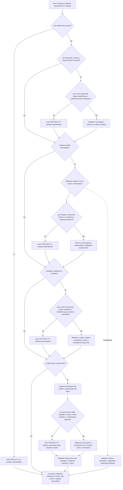

# Diagrama de Uso de Formatos TIC

Este material es una guía de apoyo para decidir cuándo conviene utilizar los formatos TIC. No reemplaza directivas, procedimientos ni estándares, y no crea obligaciones adicionales cuando Jira, Mesa de Servicios, correo, comentario estructurado o registro equivalente contiene información suficiente.

## Flujo de Decisión

## Narración del Flujo

1. Todo inicia con una solicitud, incidente, requerimiento o cambio registrado en Jira, Mesa de Servicios, correo o medio equivalente.

2. Primero se revisa si el caso corresponde a una solicitud de acceso.
   - Si es acceso, usar `FOR-ACC-TI` o campos equivalentes. Ejemplo: alta de usuario, cambio de perfil o baja de cuenta.
   - Si no es acceso, continuar con la revisión del tipo de atención.

3. Luego se verifica si el caso corresponde a desarrollo, mejora o requerimiento funcional.
   - Si es un desarrollo nuevo, mejora significativa o cambio funcional relevante, usar `FOR-REQ-TI` o campos equivalentes para dejar claro el alcance, criterios de aceptación y conformidad cuando corresponda.
   - Si es una atención simple, puede bastar el ticket o historia con la necesidad y el alcance mínimo.
   - Si no es desarrollo ni mejora funcional, pasar a evaluar si existe cambio tecnológico.

4. Después se determina si la atención implica un cambio tecnológico.
   - Si implica cambio, clasificarlo como menor, mayor o emergencia.
   - Si el cambio es mayor, emergencia o requiere evaluación formal, usar `FOR-CAM-TI` o campos equivalentes para registrar descripción, justificación, riesgo y tipo de cambio.
   - Si es un cambio menor, puede bastar el ticket con descripción, responsable y validación proporcional.
   - Si no implica cambio tecnológico, revisar directamente si requiere validación o pruebas.

5. Luego se revisa si corresponde validación o pruebas.
   - Si hay varios escenarios, riesgo medio o alto, impacto funcional o evidencia que conviene consolidar, usar `FOR-PRU-TI` o evidencia equivalente.
   - Si la validación es simple, puede bastar una captura, comentario, correo, log o resultado de ejecución en el ticket.
   - Si no requiere validación, pasar a revisar si habrá pase a producción.

6. Si habrá pase a producción, separar dos controles.
   - La aprobación del cambio confirma que el cambio puede realizarse.
   - La autorización del pase confirma que el cambio validado puede implementarse en producción.
   - Ambas evidencias pueden estar en el mismo ticket o comentario, pero deben distinguirse.

7. Para el pase a producción, evaluar si requiere preparación especial.
   - Si el pase incluye scripts, respaldo, reversa, varios cambios, ventana o coordinación especial, usar `FOR-DES-TI` o registro equivalente para preparar el pase.
   - Si el pase es simple, puede registrarse la autorización y preparación en el mismo ticket o comentario.

8. Después del pase, registrar los datos posteriores.
   - Fecha real, resultado, validación posterior, incidencias y cierre no forman parte obligatoria del formato inicial de despliegue.
   - Esas evidencias pueden quedar en Jira, comentario, bitácora, registro de despliegue o cierre técnico.

9. Si el caso es una emergencia, registrar lo mínimo necesario para atender la urgencia.
   - Luego se regularizan la justificación, acciones ejecutadas, resultado, validación y cierre.

10. Al final, conservar evidencia suficiente sin duplicar documentos.
    - Si Jira, ticket, correo o comentario ya contiene la información mínima, no es necesario llenar un archivo separado.
    - Si la información está dispersa o el caso tiene más riesgo, el formato ayuda a ordenar la evidencia.

## Comentarios y Ejemplos por Camino

- Acceso de usuario: si se crea, modifica o retira un acceso, usar `FOR-ACC-TI` o campos equivalentes en Mesa de Servicios/Jira. Ejemplo: alta de usuario con perfil aprobado por el responsable funcional.
- Cambio menor de pantalla: puede bastar ticket con descripción, responsable, captura y conformidad simple. `FOR-PRU-TI` solo se usa si ayuda a ordenar la evidencia.
- Cambio mayor BonoGas: conviene usar `FOR-REQ-TI` para alcance funcional, `FOR-CAM-TI` para evaluación del cambio, `FOR-PRU-TI` para escenarios de prueba y `FOR-DES-TI` si el pase requiere scripts, respaldo, reversa o coordinación.
- Script de base de datos con impacto: usar `FOR-CAM-TI` o evaluación equivalente, conservar script, validación, respaldo o reversa. Usar `FOR-DES-TI` si el pase requiere preparación especial.
- Cambio de emergencia: registrar justificación, responsable, acción ejecutada y resultado mínimo. La evidencia de validación, cierre y documentación complementaria puede regularizarse después.

## Lectura Rápida

| Formato | Cuándo conviene usarlo | Cuándo puede reemplazarse por Jira, ticket, correo o comentario |
|---------|-------------------------|---------------------------------------------------------------|
| FOR-ACC-TI | Alta, modificación o baja de accesos. | Cuando el registro contiene solicitante, usuario, perfil, aprobación, implementación y cierre. |
| FOR-REQ-TI | Desarrollo nuevo, mejora significativa o cambio funcional relevante. | Cuando Jira o historia contiene necesidad, alcance, criterios de aceptación y conformidad cuando corresponda. |
| FOR-CAM-TI | Registro inicial o evaluación de un cambio tecnológico, especialmente mayor o emergencia. | Cuando el ticket contiene descripción, justificación, responsable, riesgo y tipo de cambio. |
| FOR-PRU-TI | Validación con varios escenarios, riesgo medio/alto, impacto funcional o evidencia que conviene consolidar. | Cuando capturas, logs, comentarios o correos permiten reconstruir qué se validó, quién, cuándo y resultado. |
| FOR-DES-TI | Preparación del pase cuando hay scripts, respaldo, reversa, varios cambios, ventana o coordinación especial. | Cuando el ticket o comentario registra autorización del pase, componentes, responsable, fecha programada y preparación suficiente. |

## Recordatorios de Control

- No duplicar formatos si el registro principal ya contiene información suficiente.
- La aprobación del cambio y la autorización del pase a producción son controles distintos, aunque pueden constar en el mismo ticket o comentario.
- `FOR-DES-TI` sirve para preparar el pase antes de ejecutarlo; la fecha real, resultado, validación posterior y cierre se registran después en ticket, comentario, bitácora o registro equivalente.
- La evidencia debe ser proporcional al tipo, riesgo e impacto del caso.
